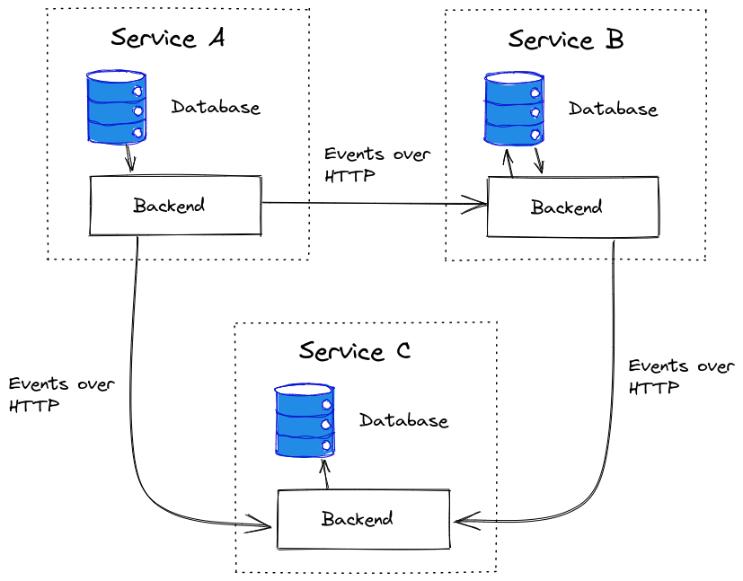

# FeedAPI

## The Kafka programming model without a broker

The core idea of FeedAPI is that:

* The decision to focus on event sourcing,
  instead of REST APIs, for your architecture...
* ...is a separate decision from choosing to use a broker. 

A popular technique for implementing business backends is
distributed event sourcing, where different services (often
developed and maintained by different teams) interact *not* by
using REST APIs, but by streaming events/each service
listening to changes that are relevant to them.

Usually, a broker such as [Apache Kafka](https://kafka.apache.org/)
is used to communicate these events. In some contexts
we found that such a broker does not add much value,
and that a *peer-to-peer* event topology works well.
By not using a broker, certain complexities disappear.
For instance, **exactly-once delivery becomes possible** all
the way to your backend's database.

## What is FeedAPI

First, FeedAPi is an idea:

1. Store the full set of events in the originating service
2. Consumers ask the originating service for events by
   *pulling* new events from a *partitioned feed* exposed
   by the publishing service.
3. Publishers are stateless and does not know about consumers 
   (except for authorization matters)
4. Consumers store the cursors it needs to consume the feeds.
   If the same database transaction
   is used for persisting the cursor as for persisting the
   result of consuming the events, one achieves **exactly-once delivery**.

Second, we offer [a pull-based HTTP protocol](SPEC.md) to communicate the
events. This protocol is pretty minimal and suitable for situations
where some 100ms of latency is OK.
The protocol is similar to RSS/Atom feeds on one hand,
but the intended uses  is closer to AMQP and Kafka.

The third component is tooling around this protocol:

* [Client/server implementations for Go](https://github.com/vippsas/feedapi-go)
* [mssql-changefeed](https://github.com/vippsas/mssql-changefeed) offers
  the primitives needed to use FeedAPI together with an Azure SQL database

Some tooling is still for the older [ZeroEventHub protocol](https://github.com/vippsas/zeroeventhub),
but may be useful:

* [Client implementation for Python](https://github.com/vippsas/zeroeventhub/tree/main/python/zeroeventhub)
* [Client implementation for .NET](https://github.com/vippsas/zeroeventhub-dotnet)

## When can FeedAPI be used?

FeedAPI requires that a service that publishes
events has all those events in its own database.
An *event* in this context doesn't mean a specific JSON
representation -- it means simply that the *facts of something
that happened at a given time* is stored (somehow, in some
representation).

For example:  A traditional SQL database schema may have a
table `Person`; say with columns `ID` and `Name`.
As a minimum, to use ZeroEventHub, you must *in addition* store
any changes to the table in a log table (such as 
`PersonNameChanged`, or `PersonChanged`).

Ourselves we have had good results with doing *event sourcing in
the SQL database*: Instead of thinking of a `Person` table
as the "primary", the focus is on the
`PersonChanged` table. Data modifications happen through
insertion of events to event tables. The `Person` table
-- if it even needs to exist! -- is simply a read-model/projection
from the events that concern  it.

## Further reading

Head to [the specification](SPEC.md) for technical details
and discussions.
